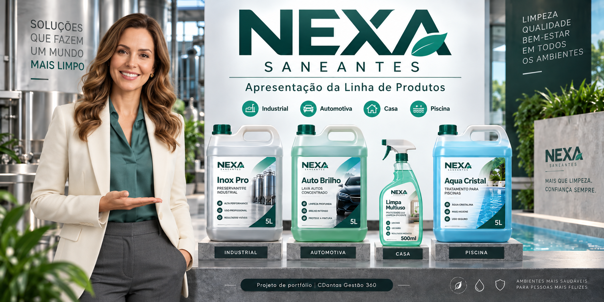

# NEXA Saneantes — Campanha Audiovisual com IA

  

Case fictício de produção audiovisual B2B desenvolvido para demonstrar o uso de inteligência artificial generativa, direção criativa, personagem virtual, edição e adaptação multiformato na comunicação de uma marca de saneantes.

## 🎥 Vídeos do case

- **Vídeo master 16:9:** [Assistir no YouTube](https://youtu.be/g3UcoU2q7po)
- **Versão vertical 9:16 para redes sociais:** [Assistir no YouTube Shorts](https://youtube.com/shorts/wTD_cQPp8SM?feature=share)

> **Aviso:** a NEXA Saneantes é uma marca fictícia criada exclusivamente para fins de portfólio. Os produtos, embalagens, personagens e materiais apresentados neste projeto não representam uma empresa ou produto comercial real.

## 📒 Sobre o projeto

O projeto nasceu como uma demonstração de como uma empresa do setor de saneantes pode apresentar diferentes linhas de produtos por meio de uma campanha audiovisual contemporânea, com linguagem visual profissional e uma apresentadora virtual consistente.

A campanha foi estruturada para mostrar aplicações em diferentes contextos de uso — industrial, automotivo, residencial e piscina — mantendo unidade estética, identidade visual e narrativa comercial.

A apresentadora virtual **Cristina Miranda** foi criada como porta-voz da marca fictícia, com postura corporativa, comunicação clara e aparência consistente entre as cenas.

## 🎯 Objetivos

- Criar um case audiovisual com aparência profissional para portfólio.
- Demonstrar aplicações de IA generativa em comunicação empresarial e marketing B2B.
- Construir uma personagem virtual reutilizável e consistente.
- Desenvolver identidade visual, embalagens fictícias e diferentes cenários de aplicação.
- Explorar fluxos de produção que combinem geração por IA e pós-produção tradicional.
- Documentar limitações reais das ferramentas e as soluções adotadas durante a produção.

## 🎬 Estrutura da campanha

O vídeo apresenta a NEXA por meio de uma sequência de ambientes e linhas de produto:

1. **Apresentação institucional** — Cristina Miranda se apresenta como personagem virtual e introduz o case.
2. **Identidade e posicionamento** — integração visual entre a personagem, a CDantas Gestão 360 e a proposta de demonstração de portfólio.
3. **Linha Industrial** — aplicação em ambientes técnicos e superfícies de aço inox.
4. **Linha Automotiva** — apresentação de produto em contexto de cuidado automotivo.
5. **Linha Casa** — solução voltada à limpeza residencial.
6. **Linha Piscina** — produto voltado à manutenção e cuidado de piscinas.
7. **Encerramento** — reunião visual das linhas da marca e fechamento institucional.

## 👩‍💼 Personagem virtual — Cristina Miranda

Cristina foi desenvolvida como apresentadora virtual da campanha. A direção da personagem buscou equilíbrio entre credibilidade corporativa, simpatia e naturalidade.

Características principais:

- aparência adulta e profissional;
- linguagem corporal natural;
- comunicação segura e acessível;
- voz em português brasileiro;
- figurino corporativo coerente com a proposta da marca;
- continuidade visual entre os diferentes ambientes.

Durante o desenvolvimento também foi criada uma variação de figurino técnico/industrial para futuras campanhas de demonstração de produtos em ambientes fabris.

## 🧴 Linhas e produtos fictícios

Foram desenvolvidos produtos conceituais para representar diferentes segmentos da NEXA, entre eles:

- **Inox Pro — Desengraxante Industrial 5L**
- **Auto Brilho — Lava Autos 5L**
- **Limpa Multiuso 500ml**
- **Aqua Cristal 5L**
- **Desinfetante Industrial NEXA 5L** — conceito criado para evolução futura da linha industrial

As embalagens e rótulos foram criados exclusivamente para este projeto de portfólio.

## 🤖 Tecnologias e ferramentas

- **ChatGPT** — planejamento, direção criativa, estruturação de roteiro, refinamento de prompts, análise de cenas e documentação do projeto.
- **Google Flow / geração de vídeo com IA** — criação de cenas, movimentos de câmera, atuação da personagem e ambientes.
- **IA generativa de imagem** — desenvolvimento de personagens, produtos, embalagens, cenários e referências visuais.
- **CapCut Desktop** — montagem, edição, ajustes de máscara, composição, correções visuais, áudio e finalização.
- **GitHub** — documentação e organização do case de portfólio.

## 🧠 Processo de criação

### 1. Conceito e posicionamento

A NEXA foi criada como marca fictícia para evitar o uso de ativos de clientes reais durante a fase de demonstração. A proposta visual adotou uma identidade própria, com predominância de verde-petróleo, grafite, branco e acabamento corporativo contemporâneo.

### 2. Desenvolvimento da personagem

A personagem Cristina foi testada em diferentes ferramentas e cenários até chegar a uma versão visual consistente. O processo mostrou que o uso de uma referência fixa de personagem é essencial para preservar rosto, cabelo, figurino e proporções ao longo das cenas.

### 3. Criação de produtos e embalagens

Foram geradas embalagens isoladas e versões com fundo neutro para uso como referência nas cenas. A experiência revelou uma limitação importante dos modelos generativos: textos, rótulos e proporções de embalagens podem sofrer distorções quando o produto é recriado diretamente em vídeo.

### 4. Geração das cenas

As cenas foram produzidas individualmente, permitindo revisar e aprovar cada trecho antes de avançar. Essa abordagem reduziu retrabalho e facilitou o controle de continuidade da personagem e dos ambientes.

### 5. Correções em pós-produção

Algumas cenas exigiram composição manual no CapCut. Um exemplo importante foi a aplicação da identidade **CDantas Gestão 360** em uma parede do cenário: em vez de depender da geração quadro a quadro da IA, foi utilizada uma imagem estática com máscara e posicionamento sobre o vídeo, evitando variações e deformações da marca.

### 6. Montagem final

A versão final privilegiou cortes limpos entre ambientes. Testes com transições mostraram que efeitos adicionais prejudicavam o ritmo e a estética do projeto, portanto a montagem manteve transições mínimas e foco na continuidade visual.

## 🧪 Problemas encontrados e soluções

### Instabilidade de logotipos e textos

Em algumas gerações, letras e logotipos mudavam de forma e tamanho durante o vídeo.

**Solução:** reduzir prompts, evitar excesso de instruções simultâneas e, quando necessário, inserir a marca na pós-produção com máscara e composição manual.

### Rótulos deformados

A IA apresentou dificuldade para manter textos de embalagem perfeitamente estáveis e legíveis.

**Solução:** trabalhar com referências isoladas, reduzir dependência de texto gerado dentro da cena e reservar correções finas para a edição.

### Escala inconsistente de produtos

Em determinadas cenas, recipientes de 5L e frascos de 500ml apareciam com proporções incorretas.

**Solução:** especificar volumes e proporções no prompt, comparar visualmente as embalagens e, quando necessário, refazer a composição.

### Voz inconsistente

Um dos primeiros takes da personagem foi gerado com voz diferente dos demais.

**Aprendizado:** sempre utilizar a personagem salva com sua voz associada e evitar reconstruir a apresentadora apenas a partir de um frame quando a consistência vocal for necessária.

### Música e áudio gerados automaticamente

Algumas cenas receberam trilha sonora automática enquanto outras vieram apenas com fala.

**Novo padrão definido:** gerar cenas sem música e realizar trilha, efeitos e mixagem posteriormente no CapCut. Em vídeos técnicos, sons ambientes podem ser adicionados separadamente para maior controle e realismo.

## 📐 Solução multiformato — de 16:9 para 9:16

Durante a evolução do projeto surgiu um problema prático: o vídeo principal havia sido concebido em **16:9**, mas a adaptação direta para **9:16** por recorte automático comprometia partes importantes da composição, incluindo apresentadora, produtos e contexto de cena.

### Problema observado

Foram testadas abordagens automáticas de corte e reformatação. Em diferentes tentativas, o enquadramento vertical:

- eliminava partes relevantes do produto ou do cenário;
- priorizava a personagem em detrimento da informação comercial;
- alterava o equilíbrio visual criado para o master 16:9;
- introduzia cortes pouco coerentes quando ferramentas automáticas selecionavam trechos intermediários ou materiais de teste.

### Solução adotada

Em vez de forçar o vídeo horizontal a ocupar toda a tela vertical, foi criado um **layout 9:16 próprio**, com o vídeo 16:9 preservado em uma área central e a identidade visual da NEXA estruturando o restante da composição.

A versão final utiliza:

- fundo grafite/preto fosco;
- identidade NEXA no topo;
- vídeo horizontal central preservando apresentadora, produto e cenário;
- identificação da linha e assinatura visual na área inferior;
- cortes manuais com preservação de frases completas;
- duração reduzida para uso em redes sociais;
- encerramento simplificado para evitar redundância de marca.

### Fluxo definido

**MASTER 16:9 → CORTE SOCIAL → TEMPLATE 9:16**

O conteúdo principal é desenvolvido primeiro no formato master. Em seguida, os trechos aprovados são selecionados manualmente para a versão social e inseridos em uma composição vertical própria.

A regra consolidada foi:

> **Criar para o formato principal, mas compor para sobreviver ao formato secundário.**

Esse processo evita depender de crop agressivo e transforma a adaptação vertical em uma etapa real de direção e edição, e não apenas em uma conversão automática.

### Resultado

A versão vertical final foi publicada como demonstração do processo de adaptação multiformato:

**[▶ Assistir à versão 9:16 no YouTube Shorts](https://youtube.com/shorts/wTD_cQPp8SM?feature=share)**

## 🎧 Padrão de áudio adotado

A partir deste projeto, o fluxo recomendado passou a ser:

- gerar **personagem + cenário + ação + fala**;
- evitar música gerada automaticamente;
- evitar textos gráficos gerados dentro do vídeo;
- adicionar trilha, efeitos ambientes, logos e textos na pós-produção;
- controlar níveis de voz, música e efeitos em faixas separadas.

Esse processo oferece maior consistência e reduz retrabalho.

## 🎨 Direção visual

A campanha foi construída com:

- ambientes corporativos e técnicos realistas;
- superfícies metálicas e iluminação suave;
- paleta verde-petróleo, grafite, branco e tons neutros;
- enquadramento 16:9 como formato master;
- master em 16:9 com adaptação vertical 9:16 realizada por layout dedicado, evitando crop agressivo;
- movimento de câmera discreto e cinematográfico;
- estética limpa, sem excesso de textos ou efeitos.

## 📱 Aplicações de comunicação

O conceito foi pensado para demonstrar potencial de uso em:

- LinkedIn B2B;
- Instagram e Reels;
- apresentações comerciais;
- campanhas institucionais;
- lançamentos de produtos;
- treinamento e demonstração técnica;
- portfólio de produção audiovisual com IA.

## 🚀 Resultado

O projeto consolidou um fluxo híbrido de produção: a IA foi utilizada para criação de personagens, cenários, produtos e movimento; a direção criativa, seleção de cenas, correção de inconsistências e finalização ficaram sob curadoria humana.

O resultado demonstra que a produção audiovisual com IA pode atingir nível comercial quando a geração é tratada como uma etapa do processo — e não como substituto integral da direção, edição e controle de qualidade.

### 🎥 Vídeos finais

- **[▶ Assistir ao vídeo master 16:9 da campanha NEXA Saneantes](https://youtu.be/g3UcoU2q7po)**
- **[▶ Assistir à versão vertical 9:16 para redes sociais](https://youtube.com/shorts/wTD_cQPp8SM?feature=share)**

## 🔬 Evolução do projeto

A próxima etapa prevista é uma campanha técnica dedicada ao **Desinfetante Industrial NEXA**, com Cristina em ambiente fabril de indústria alimentícia, figurino técnico, linguagem voltada a compradores B2B, qualidade, produção e segurança de alimentos.

A proposta inclui demonstração visual de higienização de superfícies em aço inox e construção de roteiro com abordagem técnica, sempre deixando claro que se trata de um case fictício de portfólio e que alegações técnicas reais exigem validação documental e regulatória do fabricante.

## 💭 Principais aprendizados

Este projeto reforçou alguns princípios de produção audiovisual com IA:

- prompts menores e mais objetivos tendem a produzir resultados mais consistentes;
- logos e textos críticos devem ser controlados em pós-produção;
- consistência de personagem exige referência fixa;
- produtos com rótulos complexos precisam de validação visual rigorosa;
- áudio deve ser tratado separadamente quando se busca padrão profissional;
- cenas devem ser geradas e aprovadas individualmente;
- a curadoria humana continua sendo decisiva para transformar gerações isoladas em uma campanha coerente;
- adaptação 16:9 → 9:16 funciona melhor como projeto de composição e edição do que como simples recorte automático.

## 📌 Escopo

Este repositório documenta um **projeto fictício de portfólio**. Não representa uma campanha contratada por uma empresa chamada NEXA, nem comprova registro, formulação, eficácia microbiológica, regularização sanitária ou comercialização dos produtos apresentados.

---

**Carla Dantas**  
**CDantas Gestão 360**  
IA Aplicada • Produção Audiovisual • Comunicação Empresarial • Direção Criativa

Projeto de portfólio — 2026.
